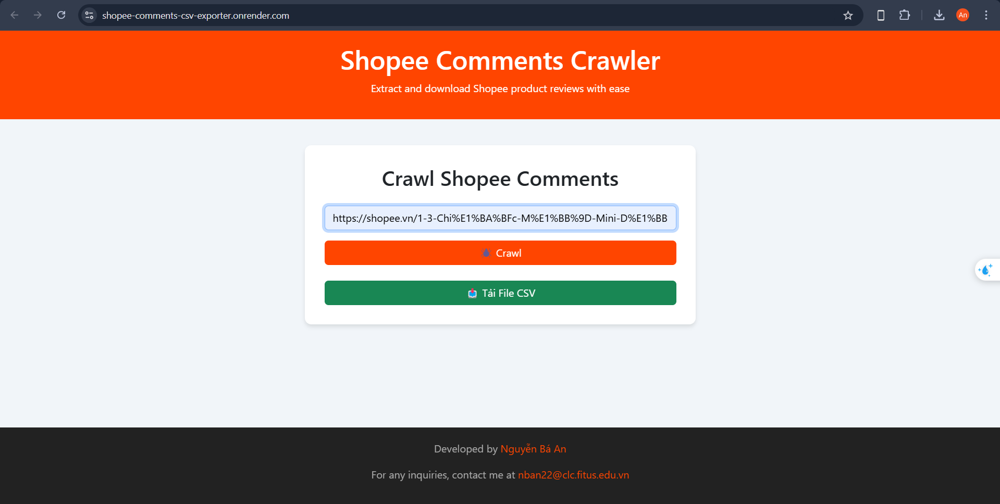

# Shopee Comments CSV Exporter

The **Shopee Comments CSV Exporter** application allows you to crawl product comments from Shopee using a product URL and export the data as a CSV file for analysis or other purposes.

## Features

- **Crawl Shopee comments**: Collect comments from Shopee products based on `shopId` and `itemId` extracted from the product URL.
- **Export data as CSV**: Comments are exported to a CSV file, with each row representing a comment.
- **Download CSV file**: After the data is exported, you can download the CSV file directly.
- **Automatic file deletion**: CSV files are automatically deleted after 5 minutes to free up storage space.

## Deployment

The application is deployed and available for use at the following URL:

[https://shopee-comments-csv-exporter.onrender.com/](https://shopee-comments-csv-exporter.onrender.com/)

You can use the deployed version to crawl product comments from Shopee and export them as CSV files directly from your browser.

## Demo

Here are a screenshot demonstrating the usage of the application:



The home page of the Shopee Comments CSV Exporter features a simple interface with:

- URL input: Users can paste a Shopee product URL.
- Crawl button: Initiates the comment extraction.
- Download button: Allows users to download the CSV file of the extracted comments.

## Installation

Follow the steps below to install and use the application locally.

### 1. Clone the repository

```bash
git clone https://github.com/nban22/shopee-comments-csv-exporter.git
cd shopee-comments-csv-exporter
```

### 2. Install dependencies

Use npm or yarn to install the required dependencies:

```bash
npm install
# or
yarn install
```

### 3. Configure environment variables

Create the `.env` file from the `.env.example` template and update any necessary values (if applicable).

```bash
cp .env.example .env
```

### 4. Start the application

Run the following command to start the application:

```bash
npm start
# or
yarn start
```

The app will run on `http://localhost:3000`.

## API

### 1. Crawl Shopee comments

- **URL**: `/api/v1/crawl`
- **Method**: `POST`
- **Body**: JSON containing the `url` of the Shopee product:

```json
{
  "url": "https://shopee.vn/product/{shopId}/{itemId}"
}
```

- **Response**: A URL to download the CSV file containing the comments.

### 2. Download the CSV file

- **URL**: `/api/v1/crawl/download/:fileId`
- **Method**: `GET`
- **Parameters**: `fileId` is the ID of the CSV file generated.

```bash
http://localhost:3000/api/v1/crawl/download/{fileId}
```

## Technologies Used

- **Node.js**: Runs the server application.
- **Express**: Manages the API routes.
- **EJS**: Used for rendering views (if applicable).
- **UUID**: For generating unique file IDs.
- **dotenv**: Loads environment variables from the `.env` file.
- **Fetch API**: For making HTTP requests to the Shopee API.

## License

This project is licensed under the MIT License - see the [LICENSE](LICENSE) file for details.

---

### Key Sections:

1. **Introduction**: Explains the purpose of the app.
2. **Features**: Lists the main features, like crawling Shopee comments and exporting them as CSV.
3. **Deployment**: Provides the link to the deployed application.
4. **Demo**: Includes images demonstrating the app’s usage.
5. **Installation**: Provides installation steps for setting up the project locally.
6. **API**: Describes the endpoints and usage for crawling and downloading comments.
7. **Technologies Used**: Lists key libraries and tools used in the project.
8. **License**: If applicable, includes the license for the project.

